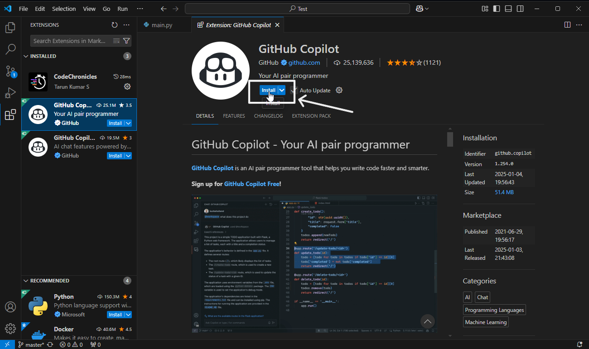
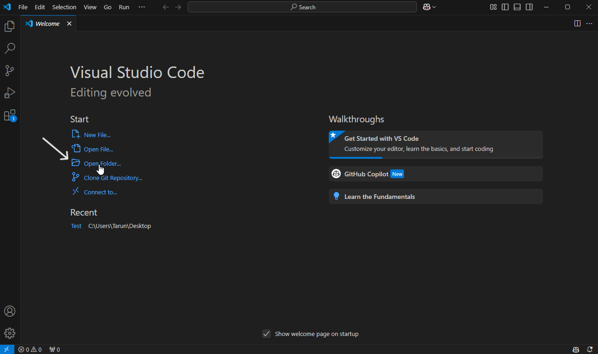
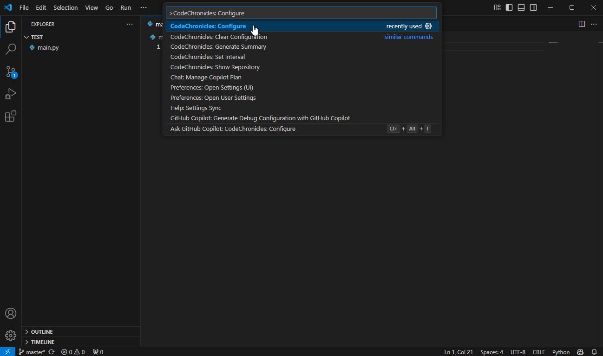

<h1 align="center">
    <b>
        
CodeChronicles

    </b>
    Transforming Your Code into a Timeless Journey!  
</h1>
<h4 align="center">
    Effortlessly merge code summaries and watch your GitHub charts shine!
</h4>

___

---

### **Table of Contents:**

1. [Introduction](#introduction)
2. [Why CodeChronicles?](#why-codechronicles)
3. [Features](#features)
4. [Installation](#installation)
5. [Configuration](#configuration)
6. [FAQ's](#faq's)
7. [Contributing](#contributing)
8. [License](#license)

### **Introduction:**
Every line of code has a story, and every commit builds your legacy. CodeChronicles ensures you never lose track of your progress by automatically merging code summaries, keeping your GitHub chart alive, and letting you focus on what truly matters—creating something extraordinary.

Start documenting your coding adventures effortlessly, one commit at a time, and watch your story unfold in the chronicles of GitHub!

#### **Head to [Installation](#installation) to setup CodeChronicles!**

#### **Want to contribute?, check out [CONTRIBUTION.md](CONTRIBUTION.md)!**

### **Why CodeChronicles?**

- **No More Gaps:** Your GitHub chart will reflect a more accurate history of your work, without missing commits.
- **Focus on Code, Not Logs:** Let CodeChronicles handle the documentation so you can spend more time writing code and building solutions.
- **Efficient Workflow:** Keep track of your coding in real-time without any extra effort.

### **Features:**

- **Automatic Code Summaries:** Every 25 minutes, CodeChronicles automatically generates a summary of your code, documenting key changes and updates.
- **GitHub Integration:** Seamlessly integrates with GitHub to ensure your contributions are up-to-date, even when you forget to commit manually.
- **Effortless Logging:** Say goodbye to manual changelogs—CodeChronicles creates a log of your code’s progress, ready to be merged into your project.
- **Track Your Coding Journey:** Stay on top of your project’s development without the hassle of maintaining a separate log or remembering what you did.
- **Customizable Time Intervals:** Set your own summary intervals to match your workflow and get the summaries as often as you need.

### **Installation:**

- ##### Requirements:
	For **CodeChronicles** to function properly, you will need the following installed on your system:
	- **GitHub Desktop**
	- **Git**
	- **GitHub Copilot (VS Code Extension)**

#### **If you have all the requirements installed already, head to [Configuration](#configuration).**

##### **The installation process might seem a bit lengthy, but it's a one-time setup, and your GitHub charts will look awesome from then on!**

- **Installing Requirements:**
	Follow the steps below to ensure all necessary requirements are installed and configured properly:
	- **GitHub Desktop**
		1. Install **GitHub Desktop** from [here](https://desktop.github.com/download/).
		2. Once GitHub Desktop is installed, log in to your GitHub account.
		
		
		
		3. Open GitHub Desktop, navigate to **Files > Options > Git**, and ensure that a name and any email (Gmail or GitHub or anything) are set.
		
		
		
		4.  Click **Save**.
		
	- **Git**
		1. Install **Git** from [here](https://git-scm.com/downloads).
		2. During the Git installation, simply click 'Next' until the installation is complete.
		3. That's all with **Git**.
		
	- **GitHub Copilot**
		1. Open **VS Code**, go to the Extensions view, and install **GitHub Copilot**.
		
		
		
		2. Click on the Copilot icon in the bottom right of VS Code, and you will be prompted to log in to GitHub. Click 'Allow' and log in to complete the process.
		
		
		
		3. Click on **Accounts** to confirm your login.
		
		
		
### **Configuration:**

1. Either through **File > Open Folder** or from the **welcome page**, open a folder in your workspace in VS Code.

	

2. Open GitHub in your browser, create a new **public** repository, and then copy the repository link. It must be similar to (https://github.com/Quanta-Naut/CodeChronicles) or (https://github.com/Quanta-Naut/CodeChronicles.git).
3. Now, go back to VS Code and press **F1** or **Ctrl + Shift + P**, and type 
	**`CodeChronicles: Configure

	

3. Once you hit Enter, you will be prompted to enter your repository link. Paste the link and make sure to add `.git` at the end, then hit Enter. Your link should look something like this: https://github.com/Quanta-Naut/CodeChronicles.git (with `.git` at the end).

	

4. Now, a window will appear asking you to sign in to GitHub. Please click **Sign In**, and you will be redirected to your browser to log in.

	

5. If you followed all the above steps correctly, you will be greeted with the message: 
	`CodeChronicles: Successfully Configured Repository.`

	

6. Just to test, create a program file (e.g., `main.py`), type a simple program like `print("Hello World")`, and save the file.
7. Now, press **F1** or **Ctrl + Shift + P**, and type **`CodeChronicles: Generate Summary`** and hit **Enter**

	

8. Make sure you have internet connection.
9. Wait for **10-15 seconds**. If everything is set up correctly, you will receive a notification saying **`CodeChronicles: Progress has been merged with the GitHub repository.`**

	

### **If you've reached this far, Congratulations! Your GitHub chart is about to look beautiful!

### **Please follow the steps below. Here are the commands to use CodeChronicles:**

### **Commands:**

All the commands listed can be executed by pressing **F1** or **Ctrl + Shift + P**.

1. **`CodeChronicles: Set Interval`**
	 **Set Interval** command allows you to set the interval at which the summary should be merged. The range of the interval is from 25 minutes to 80 minutes.
	 Every **x** minutes (within the range of 25 to 80 minutes), the summary is merged.
	 
	 
	 Hit **Enter**. And type in a valid minute between **25 - 80 minutes** 
	 
	 

2. **`CodeChronicles: Show Repository`**
	 **Show Repository** command allows you to view both the GitHub repository and the local repository.
	 
	
	
	Hit **Enter**. Here in the dialog box below, you can select:
	- **GitHub Repo**: Opens the GitHub repository in your browser where the summary is stored.
	- **Local Repo**: Opens the folder on your system where all the summaries are stored locally.
	
	

3. **`CodeChronicles: Clear Configuration`**
	**Clear Configuration** removes the stored GitHub repository and deletes the local folder where all summaries are stored (located in the local documents folder). This can be used if any mistakes are made during the setup.
	
	
	
	All data gets cleared.
	
	

4. **`CodeChronicles: Configure`**
	**Configure** command is used to set up the GitHub repository where all the summary merging happens. In the background, it automatically creates a local folder to store all the summaries.
	
	
	
	If the configuration is already set, the command will ask for confirmation:
	- **Yes (Y):** Proceeds with reconfiguration.
	- **No (N):** Cancels the configuration process."
	
	
	
	While configuring, you will be prompted to enter your GitHub repository link. Ensure the link ends with `.git` (e.g., `https://github.com/Quanta-Naut/CodeChronicles.git`)
	
	
	
	If everything is configured correctly, you will receive the message: 
	**`CodeChronicles: Successfully Configured Repository.`**
	
	

5. **`CodeChronicles: Generate Summary`**
	**Generate Summary** command forces the generation of the summary and merges it to the GitHub repository, bypassing the set interval.
	
	
	
	If everything is configured correctly, you will receive the following message:
	**`CodeChronicles: Progress has been merged with the GitHub repository.`**
	
	

### **Contributors:**

-  

### **Want to contribute?, check out [CONTRIBUTION.md](CONTRIBUTION.md)!**

---
### **License**

This project is licensed under the **MIT License** - see the [LICENSE](LICENSE) file for details.
